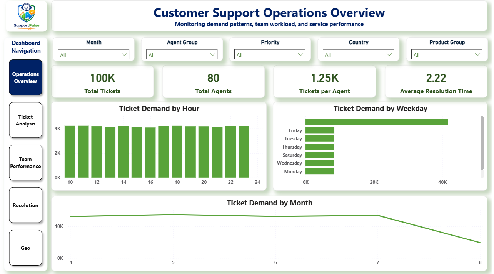
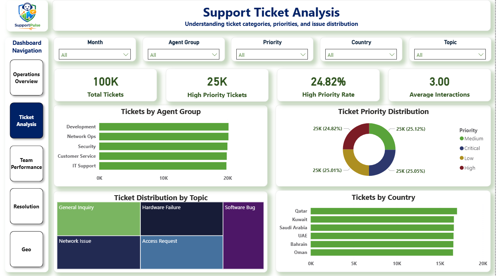
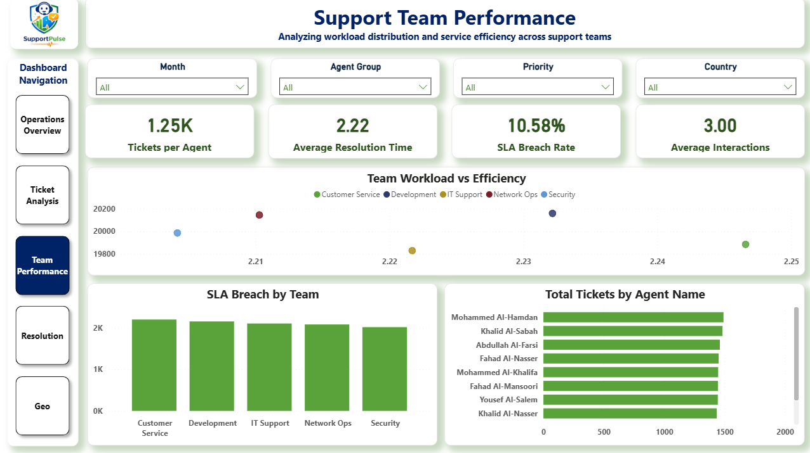
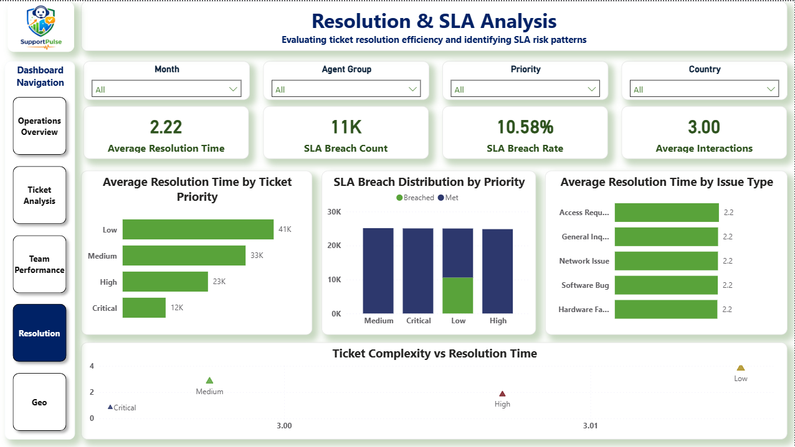
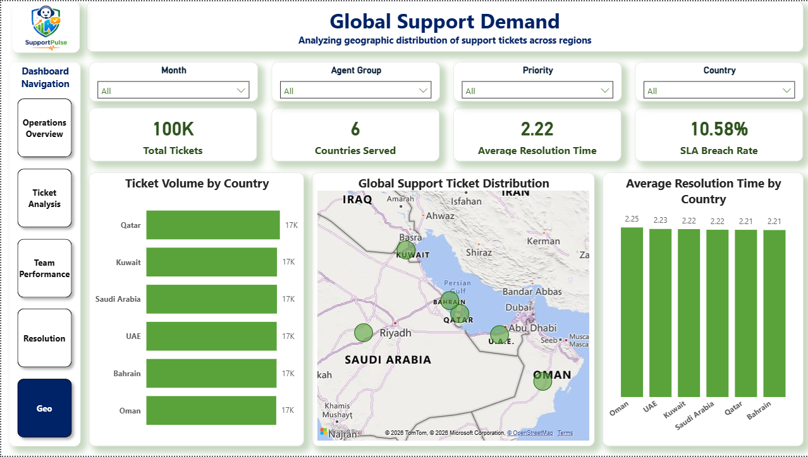

---
## Customer Support Operations Intelligence & SLA Risk Monitoring

  

**An end-to-end operational analytics project that models customer support ticket behavior to identify demand patterns, workload imbalance, service efficiency trends, and SLA risk exposure using Python and Power BI.**

The project simulates how analytics teams help **support operations leaders monitor performance, detect operational bottlenecks, and improve service delivery efficiency.**

---

# 📖 Executive Summary

### The Context

Modern customer support organizations process thousands of tickets every month across multiple teams, regions, and issue categories. Without centralized analytics, support leaders often lack visibility into workload distribution, service efficiency, and emerging SLA risks.

Operational challenges frequently arise due to:

* uneven ticket distribution across teams
* recurring issue categories generating excessive demand
* inefficient resolution workflows
* delayed identification of SLA breaches

These issues can lead to **customer dissatisfaction, longer resolution times, and operational inefficiencies.**

---

### The Objective

The objective of this project was to design an analytics system capable of monitoring support operations and answering key operational questions:

* When does support demand peak?
* Which teams experience the highest workload?
* How efficiently are tickets resolved?
* Where do SLA risks occur?
* Which issue types drive the most support demand?

---

### The Outcome

The analysis evaluated **100,000 support tickets handled by 80 agents across six countries** and produced a **five-page operational intelligence dashboard** that provides visibility into:

* demand patterns
* team workload distribution
* service efficiency
* SLA risk exposure
* geographic support demand

The resulting dashboard supports **operational monitoring, resource allocation, and service performance improvement.**

---

# 📊 Support Operations Monitoring Dashboard

A **five-page operational monitoring dashboard** was developed to provide structured visibility into support demand, service efficiency, and SLA risk patterns.

Each dashboard page addresses a **distinct operational question** and supports different decision layers within the organization.

---

# 🔹 Page 1  Operations Overview

### Purpose

This page provides a **high-level overview of support operations**, helping stakeholders quickly understand ticket volume, team capacity, and service performance.

It establishes the **overall scale of support activity and operational demand patterns.**

---

### What This Page Shows

Key operational metrics include:

* **Total Tickets:** 100,000
* **Total Support Agents:** 80
* **Tickets per Agent:** 1,250
* **Average Resolution Time:** 2.22 hours

Demand patterns are analyzed across three dimensions:

* **Ticket demand by hour**
* **Ticket demand by weekday**
* **Ticket demand by month**

---

### Operational Insight

Demand analysis reveals that ticket volume follows predictable operational cycles with higher activity during mid-week business hours.

Understanding these patterns allows support teams to **align staffing levels with expected demand peaks**, preventing backlog accumulation.

---

# 🔹 Page 2 Ticket Classification & Demand Drivers

### Purpose

This page explains **what types of issues generate support tickets and how operational workload is distributed across support teams.**

It identifies the **primary drivers of support demand.**

### What This Page Shows

Support tickets are analyzed across several dimensions:

**Agent Group Workload**

Tickets handled by:

* Development
* Network Operations
* Security
* Customer Service
* IT Support

**Ticket Priority Distribution**

Tickets are categorized into:

* Critical
* High
* Medium
* Low

This helps measure **urgency levels across incoming support requests.**

**Topic Distribution**

Common ticket categories include:

* Software Bugs
* Hardware Failures
* Network Issues
* Access Requests
* General Inquiries

### Operational Insight

Analysis reveals that a **small set of issue categories generates a disproportionate share of tickets**, suggesting opportunities for:

* improved documentation
* automation
* knowledge-base self-service solutions

---

# 🔹 Page 3 Team Performance & Workload Efficiency

### Purpose

This page evaluates **how efficiently support teams manage incoming ticket volume.**

It focuses on **workload balance, productivity, and service efficiency.**

---

### What This Page Shows

**Team Workload vs Efficiency**

A scatter plot compares:

* ticket workload per team
* average resolution time

This visualization helps identify **teams handling high workloads with slower resolution performance.**

---

**SLA Breach Monitoring**

The dashboard tracks tickets exceeding defined SLA resolution targets.

* **SLA Breach Rate:** 10.58%

---

**Agent-Level Workload**

Ticket distribution by individual agents highlights workload concentration across staff members.

---

### Operational Insight

While resolution times remain relatively consistent across teams, workload distribution varies, indicating potential opportunities to **rebalance ticket assignments across teams.**

---

# 🔹 Page 4 — Resolution Efficiency & SLA Risk

### Purpose

This page analyzes **ticket resolution performance and SLA risk exposure across priority levels and issue categories.**

---

### What This Page Shows

**Resolution Time by Priority**

Tickets are analyzed by urgency level to confirm that high-priority incidents receive faster response times.

---

**SLA Breach Distribution**

Tickets are categorized into:

* SLA Met
* SLA Breached

This helps identify operational areas where service targets are not consistently achieved.

---

**Resolution Time by Issue Type**

Different issue categories show varying resolution complexity.

---

### Operational Insight

Some issue types consistently require longer resolution times, indicating areas where **process improvements or technical documentation could improve resolution speed.**

---

# 🔹 Page 5 Geographic Support Demand

### Purpose

This page examines **geographic distribution of support demand** to understand regional service requirements.

---

### What This Page Shows

Support demand is analyzed across six countries:

* Qatar
* Kuwait
* Saudi Arabia
* UAE
* Bahrain
* Oman

The dashboard includes:

* **ticket volume by country**
* **geographic demand visualization**
* **resolution time comparison by region**

---

### Operational Insight

Demand is relatively evenly distributed across regions, suggesting that support infrastructure must maintain **consistent service coverage across all markets.**

---

# 🔁 Dashboard Usage Flow

The dashboard is designed to be used sequentially:

1. **Operations Overview** — understand overall support demand
2. **Ticket Analysis** — identify issue drivers
3. **Team Performance** — evaluate operational efficiency
4. **Resolution Analysis** — monitor SLA risk
5. **Geo Analysis** — assess regional demand patterns

Each page builds on the previous one and supports a **progressive analytical investigation.**

---

# 🛠 Methodology & Technical Design

The project follows a multi-stage analytics pipeline designed to transform raw support ticket data into actionable operational insight.

### 1️⃣ Data Preparation (Python)

Python was used to clean and prepare the dataset.

Key steps included:

* timestamp normalization
* missing value handling
* feature engineering for resolution duration
* category standardization

Libraries used:

* Pandas
* NumPy

---

### 2️⃣ Exploratory Analysis

Exploratory analysis was conducted to identify demand patterns, workload imbalance, and service efficiency trends.

Key analyses included:

* ticket volume time-series analysis
* demand cycle detection
* issue category distribution
* agent workload analysis

---

### 3️⃣ Visualization Layer (Power BI)

Power BI was used to transform analytical findings into an interactive operational monitoring dashboard.

Key dashboard features include:

* multi-page navigation
* interactive filters
* geographic demand mapping
* SLA performance monitoring
* agent workload tracking

---

# 🔍 Key Operational Insights

### 1️⃣ Support Demand Peaks Mid-Week

Ticket demand is highest during mid-week business hours, suggesting the need for **dynamic staffing allocation.**

---

### 2️⃣ Recurring Issues Drive Most Tickets

A small number of issue categories generate a significant portion of support demand.

Improving documentation or automation for these issues could significantly **reduce ticket volume.**

---

### 3️⃣ Workload Distribution Across Teams Is Uneven

Certain teams process a higher number of tickets than others, indicating potential **resource allocation inefficiencies.**

---

#### **Omkar Dhanke**

Connect with me: 

---